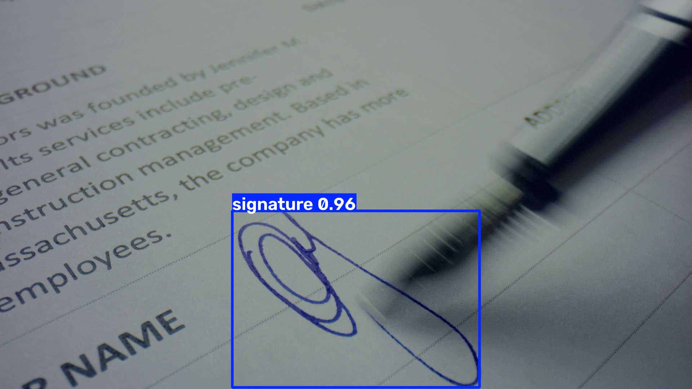
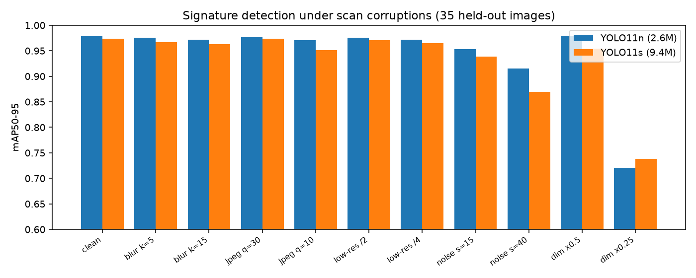

# sigdet

Document **signature detection** with YOLO11, fine-tuned on the public Ultralytics signature dataset
(143 train / 35 val images), with a **robustness study**: how detection quality degrades under realistic
scan and photo corruptions. Relevant to KYC, cheque, and contract-processing pipelines.



## Results (35 held-out images)

| Model | Params | mAP50 | mAP50-95 | Precision | Recall | Latency p50, Apple MPS | Latency p50, CPU |
|---|---|---|---|---|---|---|---|
| **YOLO11n** | 2.6M | 0.995 | 0.979 | 0.998 | 1.000 | 15.0 ms | 34.4 ms |
| YOLO11s | 9.4M | 0.995 | 0.977 | 0.998 | 1.000 | 19.6 ms | 57.1 ms |

The small model matches the larger one on clean data at ~1.7x lower CPU latency, so `n` is the shipped model
(`weights/signature_yolo11n.pt`, 60 epochs, 640px, seed 0).

## Robustness

Each corruption is applied to the 35 validation images (labels unchanged) and re-scored.



- Blur, JPEG compression down to q=10, and 4x downsampling cost under 1 point of mAP50-95.
- **Severe under-exposure is the failure mode:** at 0.25x brightness mAP50 falls from 0.995 to 0.80 for
  `n` (0.80 for `s`). Phone photos of documents in poor light are the main risk.
- Heavy sensor noise (sigma=40) mostly hurts box tightness, not detection: mAP50 stays 0.994 while mAP50-95
  drops 0.979 to 0.915 (`n`). The larger model is *less* robust here (0.870), so extra capacity did not buy
  robustness on this dataset.

Full numbers: `robustness.json`, `bench.json`; training curves: `results/`.

## Caveats

The validation set has 35 images, so differences of a point or two of mAP are within noise, and mAP50 is
saturated. The robustness study is the more informative result. Corruptions are synthetic approximations of
scan artefacts, rotation is excluded (it would need box re-derivation), and MPS training is not bit-for-bit
deterministic, so reruns can move mAP50-95 by a few thousandths.

## Use

```bash
pip install -r requirements.txt
python detect.py scan.jpg --out annotated.jpg        # prints JSON boxes
python train.py n                                      # retrain (needs the dataset; ultralytics downloads it)
python bench.py && python robustness.py n s            # regenerate bench.json / robustness.json
python -m pytest tests
```

## License

AGPL-3.0. The dataset and the `ultralytics` library are AGPL-3.0, and this repo is licensed to match.
